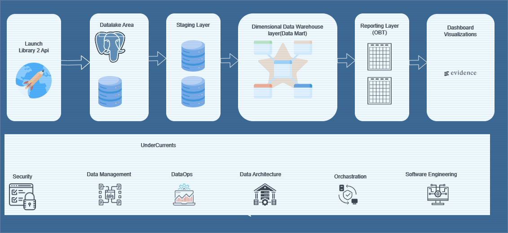
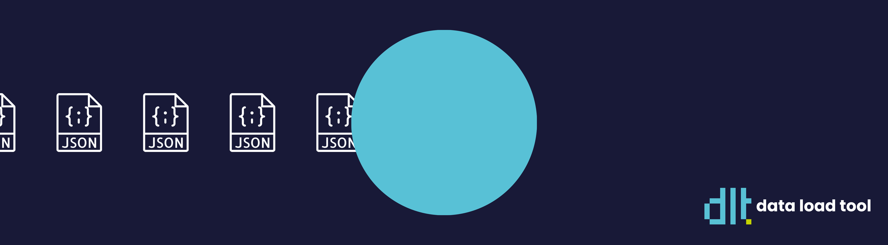
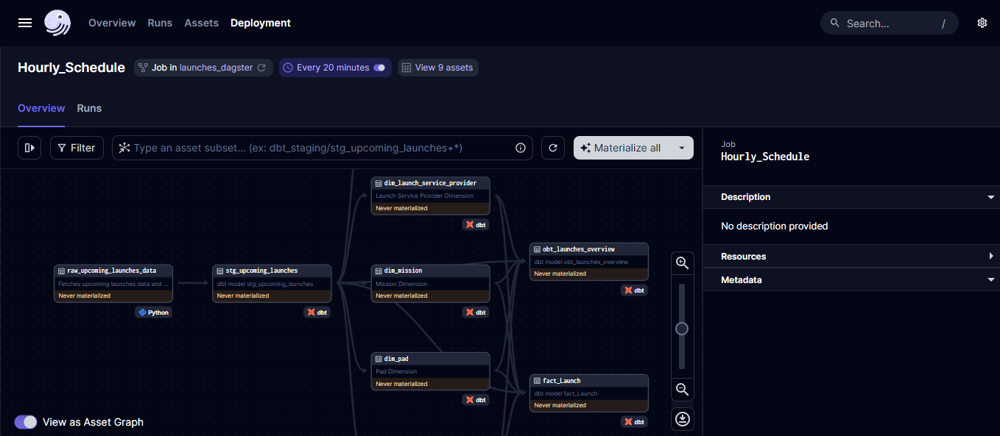
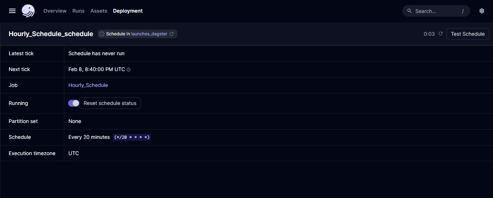
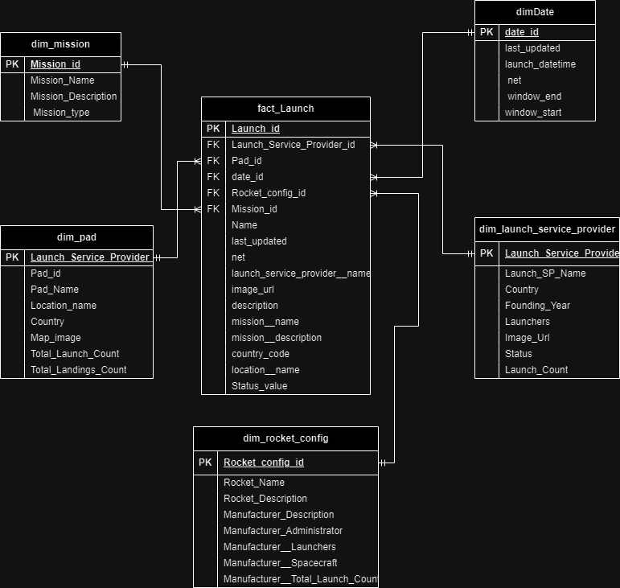
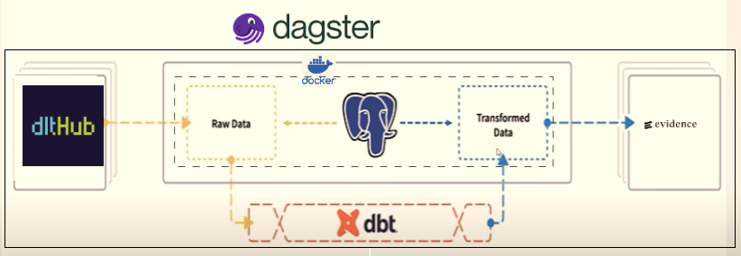
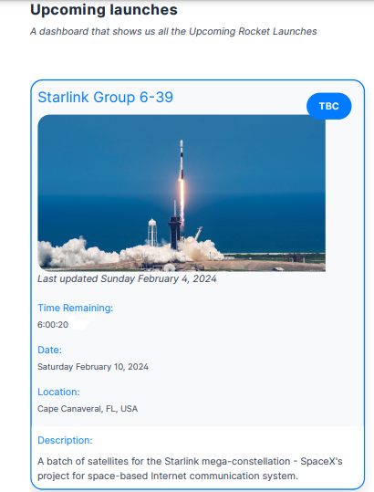

# Rocket Launch Data Engineering Project

 


####  Preface

This repository contains the  project for the  Assessment Project repository from Mooncoon Company.The project covers main fundamentals of  data engineering principles from data generation to storage, ingestion, transformation, and serving, each stage of the data engineering lifecycle is meticulously dissected providing insights into the intricate workings of the data engineering domain using open source tools like dlthub,dagster,dbt and etc.The essence of this project lies in its emphasis on the data engineering lifecycle, a timeless framework that transcends the ever-changing landscape of technological advancements. While specific tools and technologies may come and go, the overarching goal remains steadfast: to address the evolving needs of the business.

#### Problem Statement

As a Raccoon Engineer working for Mooncoon, the mission is clear: determine which rocket to infiltrate for a covert journey to our lunar base. To achieve this, the task at hand is to construct a dashboard displaying all upcoming rocket launches. The objective is to provide our Raccoon spies with timely and comprehensive information for strategic planning. 


#### Introduction

In the modern era of space exploration, data-driven decisions are paramount for success. As a Raccoon Engineer working for Mooncoon,I've been entrusted with a pivotal project by Mooncoon, an innovative space exploration company.Our mission is clear: to secure a covert passage to our lunar base by infiltrating the right rocket. To achieve this, I've been tasked with building a comprehensive dashboard that provides  information on upcoming rocket launches. This dashboard is not just a tool; it's a strategic asset that will empower our Raccoon spies to plan their next infiltration with precision.


#### Dataset Description

The  dataset for this project originates from the Launch Library 2 API, providing extensive data on rocket launches, space events, and crewed spaceflight. Managed by The Space Devs, it offers free access to valuable information crucial for strategic planning, available in JSON format. Explore it [here](https://ll.thespacedevs.com/docs/).


#### Solution

Our solution is structured into several key stages, leveraging a variety of technologies to achieve our objectives effectively.

 

###### 1.)  Data Extraction and Loading using dlt


 

dlthub, an open-source library, was employed  to gather data from the Launch Library 2 API. This library facilitates the extraction of data from various sources into well-structured datasets. Utilizing dlt's schema discovery and versioning capabilities, we ensure the seamless loading of data into our system.

###### 2.) Orchestration  

Orchestration is the process of dependency management, facilitated through automation.A large part of data engineering is extracting, transforming, and loading data between multiple sources. An engineer's goal is to automate as many processes as possible. A data orchestrator helps in this regard by managing scheduling, triggering, monitoring, and resource allocation for Data Engineering workflows.
Orchestration happens throughout the entire data engineering lifecycle. By modeling pipelines in terms of data assets, Dagster brings order and observability to the data platform. Its accompanying web-based UI provides engineers and stakeholders with insights into the  data pipelines.

 

Orchestration is one of the undercurrents to Extract-Transform-Load lifecycle .In this Project Dagster serves as the data pipeline orchestrator,this allows tasks  to  be defined and scheduled efficiently. 

 


###### 3.) Analytics engineering

Analytical engineering involves transforming raw data into insights that drive decision-making.Dbt is used  for analytical engineering in this project because it empowers SQL-savvy users to deploy analytics code following best practices like modularity, portability, CI/CD, and documentation. With dbt, one can develop, test, document, and deploy models seamlessly, ensuring data accuracy and reliability. By defining a modeling layer on top of the Data Warehouse, dbt streamlines the transformation process, turning tables into models without the need for DDL or DML, ultimately enabling efficient data-driven decision-making.

###### 4.) Data Modeling

Kimball's Dimensional Modeling approach to Data Modelling,  was used therefore utilizing the star schema for the  data mart. This involves organizing the data into fact and dimension tables, facilitating fast query performance and user-friendly data access.The star schema's clear separation of fact and dimension tables simplifies data interpretation, making it accessible even to non-technical users. By organizing data into this intuitive structure, a solid foundation for the user-friendly dashboard is establish, ensuring efficient data retrieval, comprehensive analysis, and reliable insights for informed decision-making.



###### 5.) Reporting through Visualization on the Dashboard

Finally,a user-friendly dashboard for data visualization using Evidence  designed and implemented, This open-source framework allows the building of  production-quality data products with SQL, offering features such as code-driven workflows, first-class text support, and high performance. The resulting dashboard provides actionable insights for strategic planning and decision-making.


#### Technology Stack


 


The  technology stack comprises the following tools and platforms:

1. Python for scripting and data manipulation.

2. dlthub for data extraction and loading from the Launch Library 2 API, with schema discovery and versioning features.
   
3. PostgreSQL for database storage, running in a Docker container for portability and scalability.

4. DBT for data transformation, providing SQL-based transformations and modular deployment.
   
5. Dagster for data pipeline orchestration and scheduling, offering order and observability.

6. Evidence for dashboard creation, offering code-driven workflows, text support, and high performance.

A sample of he dashboard




#### Reproducing the Project

##### Pre-Requisites

To reproduce this project, follow these steps:

**1. Clone the Project Repository**


Command:

``` 
git clone https://github.com/Ajay263/mooncoon_dashboard.git
```
   
**2.Install Project Dependencies**

Navigate to the src folder.

Run the Command

 ```
 pip install -r requirements.txt
 ```

 **3.Setting up PostgreSQL Database**

Setup PostgreSQL using Docker:

Run the Command

``` 
docker-compose up -d
```


**4. Configuring DLT**

 * Connect DLT to PostgreSQL*

   - Obtain PostgreSQL IP Address

        Run the Commands  to get container ID

        ```
        docker container ls
        ````

        ```
        docker inspect <container_id>
        ``` 
         and note the IP Address.


* Add IP Address to secrets.toml under .dlt:

    Path: 

    ```
    cd mooncoon_dashboard/src/etl/mooncoon_dashboard_transformations/orchastration_dagster/orchastration_dagster
    ```
*Update IP Address in secrets.toml*.

**5. Connecting to PGAdmin**

* Open PGAdmin:

   * Access: ``http://localhost:8080``

    * Add New Server:

    ```
    Server Name: <server_name>

    Connection Host: <docker_image_name> (pgdatabase)

    Username: root

    Password: root
    ```

  **6. Configuring Credentials for DBT**

    * Configure DBT:

        **Update PostgreSQL Credentials**

        Run Command 
        
        ```
        cd ~/.dbt
        ```
        Edit profiles.yml using nano.

        ```
        nano profiles.yml

        ```
        ***Update host with PostgreSQL container IP Address.***


**7. Accessing the Dagster UI**


Navigate to  the folder 

```
cd mooncoon_dashboard/src/etl/mooncoon_dashboard_transformations/orchastration_dagster
```

To Access Dagster's UI.Run  Command

```
DAGSTER_DBT_PARSE_PROJECT_ON_LOAD=1 dagster dev
```


**8. Accessing the  Evidence Dashboard**

Navigate to  the folder 

```
  cd mooncoon_dashboard/src/dashboard/evidence
```

To Access Evidence Dashboard.Run  Command

```
Run Server: npm run dev -- --host 0.0.0.0

```

When the Ui for the Evience.dev dasbhboard opens you can navigate to the settings and set the setting for your database .Take note for the host use the  Postgres container  IP Address.


## Areas for Improvement and Best Practices

**1. Implementing Continuous Integration / Continuous Deployment (CI/CD)**

- Enhance automation and integration of CI/CD pipelines to streamline the development, testing, and deployment processes.

**2. Dockerization:**

-  Fully dockerize the project to ensure consistency and portability across different environments.

**3. Security and Access Control:**

- Strengthen security measures by implementing role-based access control (RBAC) mechanisms to restrict access to sensitive data and systems.

**4. DataOps**

- Foster a culture of collaboration and communication between data engineering, data science, and operations teams to streamline data workflows.
- Continuously monitor and optimize data pipelines for performance, scalability, and reliability.

Perform deeper data analysis